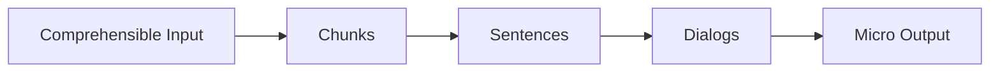

<div align="center">

# 🇰🇷 KR-NKAcademy

### _Natural Korean Acquisition — From Zero to TOPIK II_

<p align="center">
  
</p>

---


[](./CHANGELOG.md)

---

### A natural Korean learning app built with the

### **NKA method (Natural Korean Acquisition)**

Learn Korean through meaningful input, real-life chunks, immersive dialogs, and a full 52-week structured curriculum.

</div>

---

## 🧠 NKA Learning Flow (visual overview)



---

## 🎯 What is NKAcademy?

**NKAcademy** is a Korean-learning project designed around a simple idea:

> **“Learn Korean naturally — the way humans acquire languages, not the way school teaches them.”**

The goal is to deliver a **fully guided 52-week learning path**, based on:

- Natural Korean Acquisition (NKA)
- massive comprehensible input
- immersion-first learning
- chunk-based vocabulary
- simple, progressive dialogs
- micro-output (1–3 sentences/day)
- curated weekly content
- no grammar memorization — only intuitive pattern recognition

NKAcademy is both a **method** and a **curriculum**.

---

## ✨ Features

### ✔ Available

- Structured repository with double licensing
- Weekly data structure
- NKA-optimized content format

### 🚧 In Progress

- Learning engine
- Interactive sentence/chunk explorer

### 🚀 Planned

- Audio for all dialogs
- Shadowing mode
- SRS for chunks
- Immersion video recommendations
- TOPIK preparation system
- Offline PWA
- User progress tracking

---

## 🔧 Installation (Basic)

```bash
git clone https://github.com/LaurentGourouvin/KR-NKAcademy
cd KR-NKAcademy
npm install
npm run dev
```

---

## 🗺️ Roadmap

### 📘 Content Development

- [x] Week 01 dataset (sentences, chunks, dialogs)
- [ ] Week Block 1 — Weeks 02–04
- [ ] Week Block 2 — Weeks 05–12
- [ ] Week Block 3 — Weeks 13–24
- [ ] Week Block 4 — Weeks 25–52
- [ ] Audio generation for chunks, sentences, and dialogs

### 🧠 Learning Features

- [ ] Chunk Explorer (searchable, categorized patterns)
- [ ] Dialog Player (audio + bilingual line-by-line view)
- [ ] Shadowing Mode (listen → repeat → timed auto-next)
- [ ] SRS (Spaced Repetition System) for chunk review
- [ ] TOPIK II preparation tools (reading + vocab packs)

### 📱 Application Features

- [ ] Offline PWA support (fully available offline)
- [ ] User progress tracking (local storage)
- [ ] Optional cloud sync (future enhancement)
- [ ] App settings (audio speed, romanization toggle, dark mode)

### 🛠 Development & Infrastructure

- [x] Dual-license model (MIT for code, CC BY-NC-ND for data)
- [ ] JSON schema validation for all weekly datasets
- [ ] Automated dataset generator (CLI or script)
- [ ] Audio pipeline (AI TTS generator + auto file linking)

---

## 📦 Repository Structure

```pgsql
KR-NKAcademy/
│
├── LICENSE ← MIT License (code)
├── README.md
│
├── app/ ← Frontend (Next.js App Router)
├── components/ ← Reusable UI components
├── domain/ ← Core NKA logic (models, rules, engine)
├── hooks/ ← Reusable React hooks
├── services/ ← Modules handling external interactions (API, storage, loaders)
├── types/ ← Shared TypeScript models & interfaces
│
└── public/ ← Public static assets
├── data/ ← Learning content (CC BY-NC-ND — protected)
│ ├── LICENSE ← CC BY-NC-ND 4.0 license (educational data)
│ ├── _curriculum.json
│ ├── _topik-map.json
│ ├── week01/
│ │ ├── sentences.json
| | ├── exercices.json
│ │ ├── chunks.json
│ │ ├── dialogs.json
│ │ ├── meta.json
│ │ └── audio/
│ └── week02/
│ │ ├── sentences.json
| | ├── exercices.json
│ │ ├── chunks.json
│ │ ├── dialogs.json
│ │ ├── meta.json
│ │ └── audio/
│
└── assets/ ← images, icons, fonts, UI assets
```

---

## 🧩 Chunks vs Sentences

KR-NKAcademy separates learning content into **chunks** and **sentences**, inspired by the NKA method (Natural Korean Acquisition).

### **Chunks (`chunks.json`)**

Small reusable language blocks or patterns used to build natural Korean.
Examples:

- 감사합니다
- 저는 …이에요
- … 하고 싶어요

Chunks are _building blocks_ rather than full sentences.

### **Sentences (`sentences.json`)**

Complete, meaningful sentences used for immersion and comprehension.
Examples:

- 저는 프랑스 사람이에요.
- 오늘 바빠요.

Sentences often _contain several chunks_, helping learners recognize patterns naturally.

## This separation allows the app to provide both structured input (sentences) and practical output tools (chunks) for real-life use.

## 📚 Weekly Content Format

### `meta.json`

```json
{
  "week": 1,
  "title": "Premiers pas : se présenter simplement",
  "theme": "Se présenter, dire son nom, dire d’où l’on vient, premières phrases polies.",
  "speechLevel": "polite",
  "objectives": [
    "Saluer poliment en coréen (안녕하세요).",
    "Dire son nom et sa nationalité.",
    "Utiliser la forme 이에요/예요 pour faire des phrases simples.",
    "Comprendre un mini-dialogue de présentation."
  ],
  "grammarFocus": [
    {
      "kr": "안녕하세요",
      "fr": "Formule de salutation polie (« bonjour »).",
      "rom": "annyeonghaseyo"
    },
    {
      "kr": "이에요 / 예요",
      "fr": "Copule « être » en registre poli (je suis X, c’est X).",
      "rom": "ieyo / yeyo"
    }
  ],
  "vocabulary": [
    { "kr": "안녕하세요", "fr": "bonjour", "rom": "annyeonghaseyo" },
    { "kr": "저", "fr": "je (formel)", "rom": "jeo" },
    { "kr": "이름", "fr": "nom", "rom": "ireum" },
    { "kr": "사람", "fr": "personne", "rom": "saram" },
    { "kr": "프랑스", "fr": "France", "rom": "peurangseu" },
    {
      "kr": "만나서 반가워요",
      "fr": "ravi de vous rencontrer",
      "rom": "mannaseo bangawoyo"
    },
    { "kr": "감사합니다", "fr": "merci", "rom": "gamsahamnida" },
    { "kr": "네", "fr": "oui", "rom": "ne" },
    { "kr": "아니요", "fr": "non", "rom": "aniyo" },
    { "kr": "학생", "fr": "étudiant", "rom": "haksaeng" }
  ],
  "audioBasePath": "/audio/week01/",
  "notes": "Toutes les phrases sont en 존댓말 (forme polie, yo-form)."
}
```

### `sentences.json`

```json
[
"audioBasePath": "/audio/week01/sentences/",
  "sentences": [
    {
      "id": "week01-s01",
      "kr": "안녕하세요.",
      "rom": "annyeonghaseyo.",
      "fr": "Bonjour.",
      "audio": "week01-s01.mp3",
      "order": 1,
      "tags": ["greeting"]
    },
    {
      "id": "week01-s02",
      "kr": "저는 로랑이에요.",
      "rom": "jeoneun Rorang-ieyo.",
      "fr": "Je suis Laurent.",
      "audio": "week01-s02.mp3",
      "order": 2,
      "tags": ["self-intro"]
    },
  ]
]
```

### `chunks.json`

```json
[
  "audioBasePath": "/audio/week01/chunks/",
  "chunks": [
    {
      "id": "week01-ch01",
      "title": "Saluer et se présenter",
      "description": "Dire bonjour et dire qui on est.",
      "sentenceIds": ["week01-s01", "week01-s02", "week01-s03", "week01-s04"],
      "audio": "/audio/week01/chunks/week01-ch01.mp3",
      "order": 1,
      "level": "A1",
      "tags": ["greeting", "self-intro", "week01"]
    },
    {
      "id": "week01-ch02",
      "title": "Répondre et réagir",
      "description": "Dire merci, confirmer, corriger poliment.",
      "sentenceIds": ["week01-s05", "week01-s06", "week01-s07"],
      "audio": "/audio/week01/chunks/week01-ch02.mp3",
      "order": 2,
      "level": "A1",
      "tags": ["reaction", "politeness", "week01"]
    }
  ]
]
```

### `dialogs.json`

```json
  "dialogs": [
    {
      "id": "week01-dialog01",
      "title": "Première rencontre",
      "speechLevel": "polite",
      "level": "A1",
      "tags": ["intro", "week01", "conversation"],
      "audioFull": "/audio/week01/dialogs/week01-dialog01-full.mp3",
      "turns": [
        {
          "id": "week01-dialog01-t01",
          "speaker": "민서",
          "sentenceId": "week01-s01",
          "kr": "안녕하세요.",
          "rom": "annyeonghaseyo.",
          "fr": "Bonjour.",
          "audio": "/audio/week01/dialogs/week01-dialog01-t01.mp3"
        },
        {
          "id": "week01-dialog01-t02",
          "speaker": "로랑",
          "sentenceId": "week01-s02",
          "kr": "안녕하세요. 저는 로랑이에요.",
          "rom": "annyeonghaseyo. jeoneun Rorang-ieyo.",
          "fr": "Bonjour. Je suis Laurent.",
          "audio": "/audio/week01/dialogs/week01-dialog01-t02.mp3"
        },
        {
          "id": "week01-dialog01-t03",
          "speaker": "민서",
          "sentenceId": "week01-s04",
          "kr": "저는 민서예요. 만나서 반가워요.",
          "rom": "jeoneun Minseo-yeyo. mannaseo bangawoyo.",
          "fr": "Je suis Minseo. Ravie de vous rencontrer.",
          "audio": "/audio/week01/dialogs/week01-dialog01-t03.mp3"
        },
        {
          "id": "week01-dialog01-t04",
          "speaker": "로랑",
          "sentenceId": "week01-s05",
          "kr": "저도 반가워요.",
          "rom": "jeodo bangawoyo.",
          "fr": "Ravi également.",
          "audio": "/audio/week01/dialogs/week01-dialog01-t04.mp3"
        }
      ]
    }
  ]
```

### `exercises.json`

```json
{
  "audioBasePath": "/audio/week01/exercises/",
  "exercises": [
    {
      "id": "week01-ex01",
      "title": "Saluer correctement",
      "type": "vocab",
      "instructions": "Choisissez la bonne traduction pour « 안녕하세요 ». ",
      "items": [
        {
          "id": "week01-ex01-i01",
          "prompt": "Que signifie « 안녕하세요 » ?",
          "kr": "안녕하세요",
          "rom": "annyeonghaseyo",
          "options": ["Au revoir", "Bonjour", "Merci"],
          "answer": "Bonjour",
          "audio": "week01-ex01-i01.mp3"
        }
      ]
    },
    {
      "id": "week01-ex02",
      "title": "Se présenter",
      "type": "grammar",
      "instructions": "Complétez mentalement la phrase en utilisant 이에요/예요.",
      "items": [
        {
          "id": "week01-ex02-i01",
          "prompt": "« Je suis Laurent. » en coréen (avec la forme polie).",
          "answer": "저는 로랑이에요.",
          "kr": "저는 로랑이에요.",
          "rom": "jeoneun Rorang-ieyo.",
          "fr": "Je suis Laurent.",
          "sentenceId": "week01-s02",
          "audio": "week01-ex02-i01.mp3"
        }
      ]
    },
    {
      "id": "week01-ex03",
      "title": "Associer la phrase et la traduction",
      "type": "vocab",
      "instructions": "Lisez la phrase en coréen et essayez de retrouver la bonne traduction.",
      "items": [
        {
          "id": "week01-ex03-i01",
          "prompt": "Quelle est la traduction de : « 저는 프랑스 사람이에요. » ?",
          "kr": "저는 프랑스 사람이에요.",
          "rom": "jeoneun peurangseu saram-ieyo.",
          "options": [
            "Je suis Français.",
            "Je suis étudiant.",
            "Je suis coréen."
          ],
          "answer": "Je suis Français.",
          "sentenceId": "week01-s03",
          "audio": "week01-ex03-i01.mp3"
        }
      ]
    }
  ]
}
```

---

## 🔐 Licensing

KR-NKAcademy uses a **dual-license model**:

### ✔ Source Code — MIT License

All code outside the `/data` folder is licensed under MIT.  
You may use, modify, fork, or build upon it freely.  
See: [`LICENSE`](./LICENSE)

### ✔ Educational Content — CC BY-NC-ND 4.0

All learning content inside the `/data` folder is licensed under **CC BY-NC-ND 4.0**, which:

- prohibits **commercial use**,
- prohibits **modification**,
- prohibits **redistribution of altered or derived content**.

See: [`data/LICENSE`](./public/data/LICENSE)

**Summary:**

- **Code = open and free**
- **Data = protected and non-commercial**

---

## 🧪 Vision

NKAcademy aims to become a complete, modern Korean-learning journey:

- intuitive and immersive
- based on real language acquisition
- structured week-by-week
- open-source for developers
- protected for educational content
- focused on understanding and input rather than grammar memorization

It is both a personal learning tool and a public experiment in natural language acquisition.

---

## 💡 Why KR-NKAcademy?

I created this project because I want to work in South Korea.  
To make this possible, I’ve set a clear personal goal: learn Korean and reach TOPIK level 4–5 within the next two years.

KR-NKAcademy is both a tool and a challenge — a way to combine two objectives:

- building a real technical project to grow as a developer
- learning Korean through a structured, natural, and intuitive method

By developing this app, I’m not only improving my engineering skills,  
I’m also creating the learning platform I wish existed for myself.

---

## 🤝 Contributing

Contributions are welcome for:

- UI/UX improvements
- Audio processing
- Korean content verification
- Tooling & automation

Please open an issue first to discuss changes.

---

## ⚖️ Legal & Non-Profit Notice

KR-NKAcademy is a personal, non-profit project.  
It is developed independently, with no commercial intent and no affiliation with any company, employer, or former employer.

All educational data in the `/data` folder is protected under **CC BY-NC-ND 4.0**, which prohibits any commercial use, redistribution, or modification.

This project is created solely for:

- personal language learning
- technical development practice
- open-source sharing

No revenue is generated, and no commercial services are offered or planned.

---

## 🧑‍💻 Author

[](https://www.linkedin.com/in/laurentgourouvin)  
Laurent Gourouvin  
2025 — KR-NKAcademy  
Natural Korean Acquisition Project

---

## 🛠️ Tech Stack

<p align="left">
  
  
  
  
  
</p>

### **Core**

- Next.js 16 (App Router, Server Components)
- React 19

### **Styling**

- TailwindCSS 4
- PostCSS

### **Language**

- TypeScript 5

### **Tooling**

- ESLint 9
- Types: Node, React, ReactDOM

### **Architecture**

- App Directory structure
- MIT + CC BY-NC-ND dual licensing
